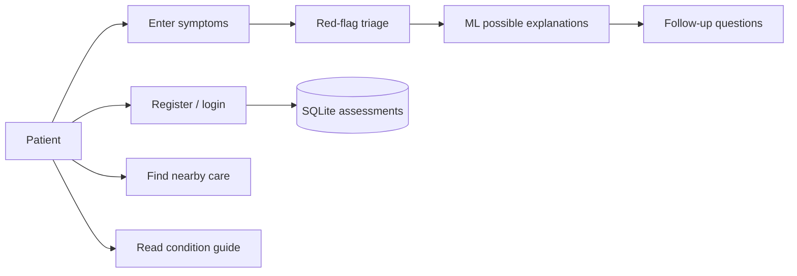
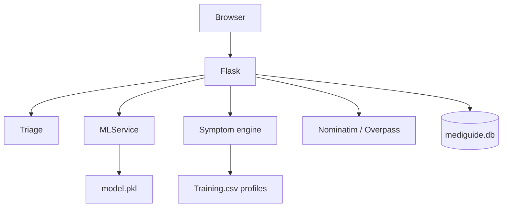
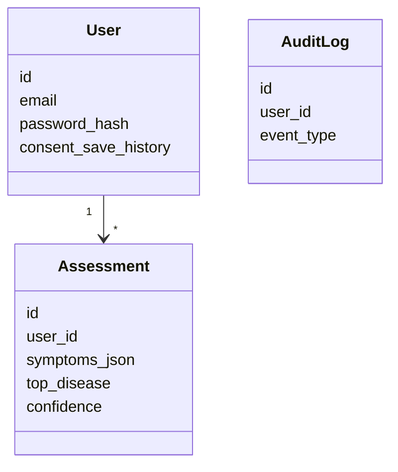
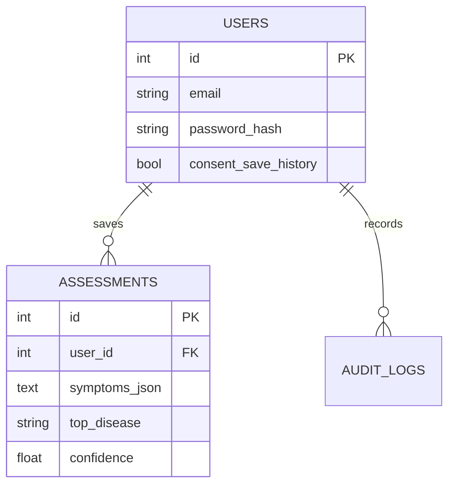
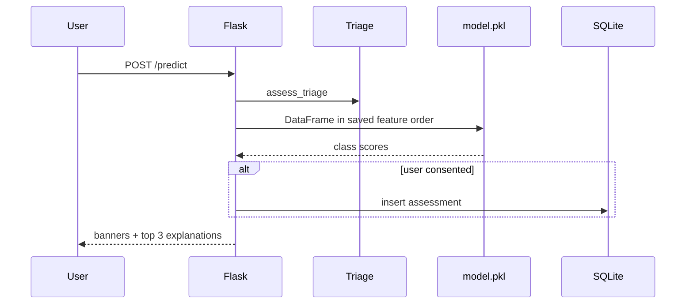

# Diagrams (Mermaid)

## Use case

```mermaid
flowchart LR
  U[Patient] --> SC[Enter symptoms]
  U --> ACC[Register / login]
  U --> FIND[Find nearby care]
  U --> GUIDE[Read condition guide]
  SC --> TRIAGE[Red-flag triage]
  TRIAGE --> ML[ML possible explanations]
  ML --> FU[Follow-up questions]
  ACC --> DB[(SQLite assessments)]
```

## Data flow

```mermaid
flowchart TD
  Browser --> Flask
  Flask --> Triage
  Flask --> MLService
  MLService --> ModelPkl[model.pkl]
  Flask --> Engine[Symptom engine]
  Engine --> Training[Training.csv profiles]
  Flask --> OSM[Nominatim / Overpass]
  Flask --> SQLite[(mediguide.db)]
```

## Class view

```mermaid
classDiagram
  class User {
    id
    email
    password_hash
    consent_save_history
  }
  class Assessment {
    id
    user_id
    symptoms_json
    top_disease
    confidence
  }
  class AuditLog {
    id
    user_id
    event_type
  }
  User "1" --> "*" Assessment
```

## ER

```mermaid
erDiagram
  USERS ||--o{ ASSESSMENTS : saves
  USERS ||--o{ AUDIT_LOGS : records
  USERS {
    int id PK
    string email
    string password_hash
    bool consent_save_history
  }
  ASSESSMENTS {
    int id PK
    int user_id FK
    text symptoms_json
    string top_disease
    float confidence
  }
```

## Sequence (symptom check)

```mermaid
sequenceDiagram
  participant U as User
  participant W as Flask
  participant T as Triage
  participant M as model.pkl
  participant D as SQLite
  U->>W: POST /predict
  W->>T: assess_triage
  W->>M: DataFrame in saved feature order
  M-->>W: class scores
  alt user consented
    W->>D: insert assessment
  end
  W-->>U: banners + top 3 explanations
```
